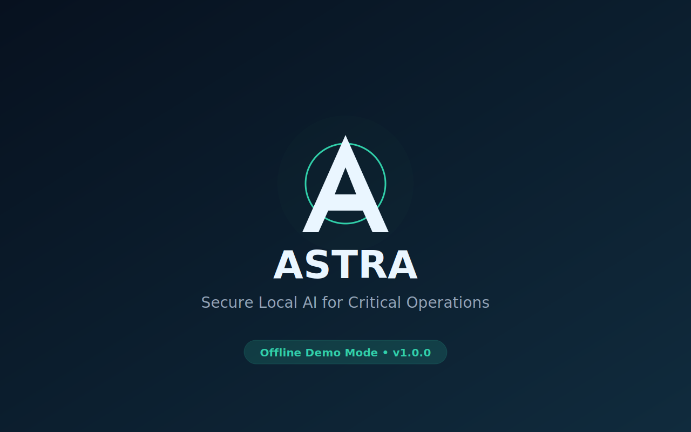
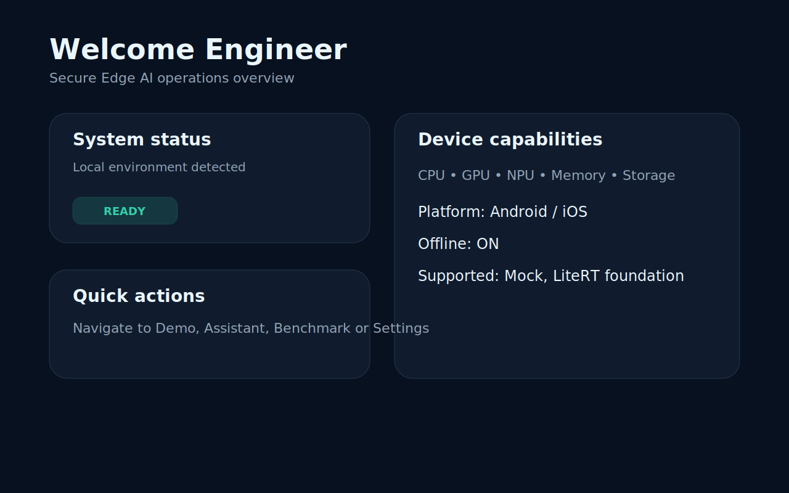
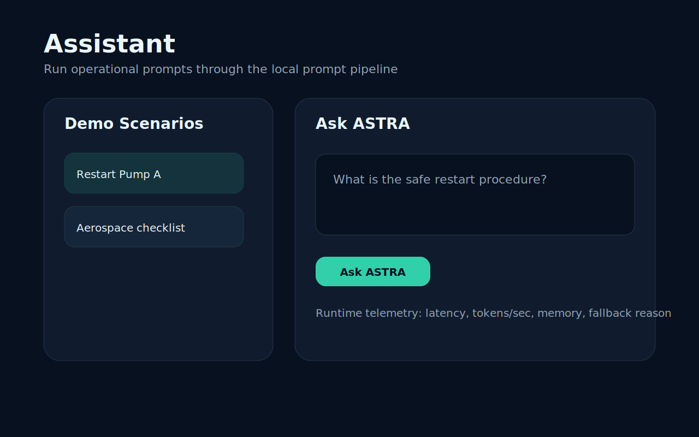
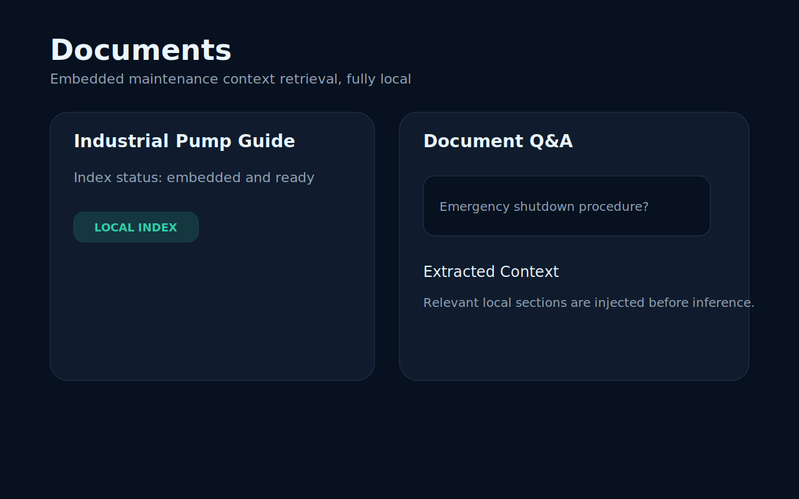
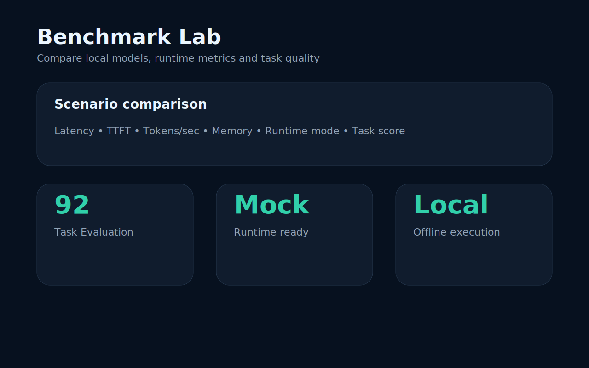
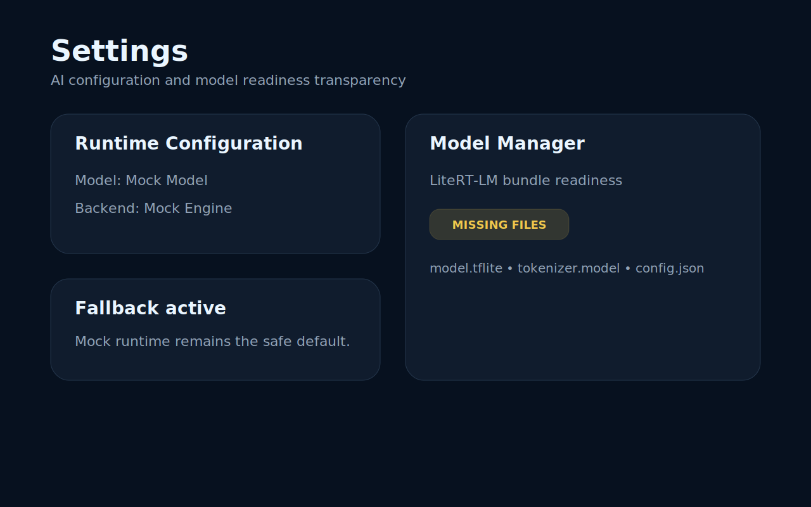
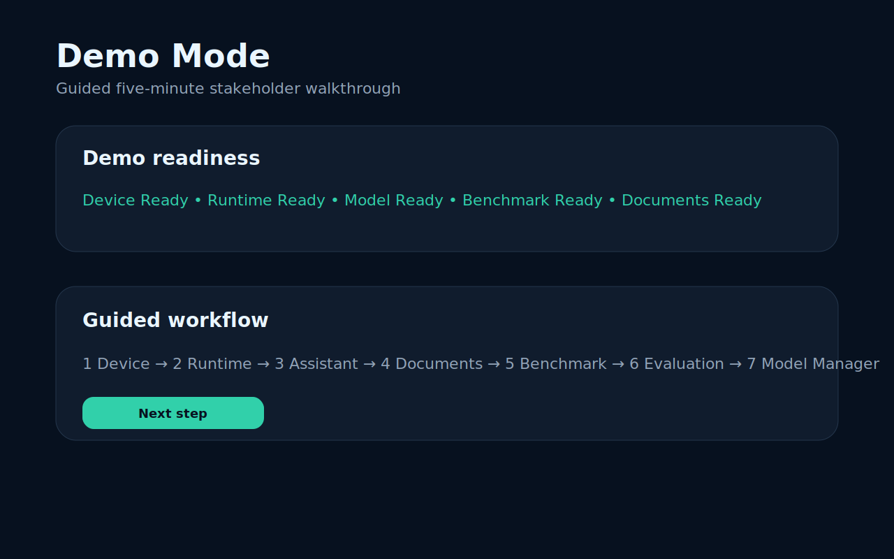

# ASTRA

> Secure Local AI for Critical Operations
> Version 1.0.0 release candidate

ASTRA is a cross-platform Edge AI demonstration application built with Kotlin Multiplatform and Compose Multiplatform. It helps engineers and innovation teams evaluate, explain and demonstrate Small Language Model workflows that run locally on-device, with transparent fallback when production model files are not available.

ASTRA is not a general chatbot. It is a technical showcase for offline-first AI architecture, runtime readiness, benchmarking, document grounding and model transparency.

## Project overview

ASTRA demonstrates how critical-operation assistants can be designed without depending on cloud execution by default. The application includes:

- a guided Demo Mode for five-minute stakeholder walkthroughs;
- a device dashboard for platform capability inspection;
- a local assistant powered by a deterministic Mock runtime;
- an embedded Documents Assistant for local context retrieval;
- a Benchmark Lab with runtime metrics and task evaluation;
- a Model Manager that explains local file readiness and fallback status;
- a Project Overview screen for architecture discussions.

The v1.0.0 release candidate is presentation-ready and intentionally conservative: real model downloads, remote registries and cloud inference are out of scope.

## Screenshots

The screenshots below are documentation panels stored in `docs/images/` for release discussions and README previews.

| Splash | Dashboard |
|:--:|:--:|
|  |  |

| Assistant | Documents |
|:--:|:--:|
|  |  |

| Benchmark | Settings |
|:--:|:--:|
|  |  |

| Demo Mode |
|:--:|
|  |

## Architecture

ASTRA follows Clean Architecture with an MVI presentation layer:

```text
Presentation
  ├── Compose screens
  ├── immutable State
  ├── typed Intent
  └── ViewModel reducers

Domain
  ├── AI configuration
  ├── benchmark contracts
  ├── document contracts
  ├── task evaluation
  └── model readiness

Data
  ├── static model/backend catalogs
  ├── embedded demo scenarios
  ├── document indexing
  └── persistent settings

Core
  ├── PromptPipeline
  ├── RoutingInferenceEngine
  ├── MockInferenceEngine
  ├── LiteRT foundation
  ├── LiteRT-LM foundation
  └── DeviceCapabilityProvider

Platform
  ├── Android runtime adapters
  └── iOS runtime adapters
```

Key principles:

- Kotlin Multiplatform shared logic and UI;
- Koin dependency injection;
- offline-first behavior;
- replaceable model and backend abstractions;
- transparent fallback instead of fake runtime claims;
- reusable ASTRA design system components.

## Features

### Dashboard

Displays local platform information, memory, storage, supported features and supported inference backends.

### Assistant

Runs curated operational prompts through the prompt pipeline and local inference abstraction. The Mock runtime provides deterministic offline output and metrics for demos.

### Documents

Indexes an embedded maintenance document and retrieves relevant context locally before asking ASTRA.

### Benchmark

Compares catalog models against demo scenarios and reports latency, time to first token, memory usage, runtime mode and task evaluation quality.

### Task Evaluation

Scores responses against safety, procedure completeness, technical accuracy, domain terminology and clarity.

### Model Manager

Shows model readiness, required files, supported backends, expected size and why fallback is active when local model bundles are missing.

### Demo Mode

Guides a stakeholder walkthrough across device capabilities, runtime selection, assistant, documents, benchmark, task evaluation and model manager.

### Project Overview

Provides a read-only technical architecture explorer directly inside the app.

## Supported platforms

| Platform | Status | Notes |
|---|---|---|
| Android | Supported | Compose UI, device capability provider, Mock runtime, LiteRT/LiteRT-LM foundations. |
| iOS | Supported | Compose UI, Mock runtime and static readiness/fallback transparency. |
| Desktop | Future | Not part of v1.0.0. |

## Runtime and model status

| Runtime | Status |
|---|---|
| Mock Engine | Installed and demo-ready. |
| LiteRT | Foundation implemented; requires local Android model assets for real execution. |
| LiteRT-LM | Foundation implemented; Android model bundle readiness is surfaced in Model Manager. |
| ONNX Runtime | Cataloged for future work. |
| Core ML | Cataloged for future work. |
| llama.cpp | Cataloged for future work. |

Production model downloads are intentionally not implemented in v1.0.0.

## Build instructions

### Requirements

- JDK 17+
- Android Studio or compatible Android SDK
- Xcode for iOS builds on macOS
- Gradle wrapper included in the repository

### Android

```bash
./gradlew :androidApp:assembleDebug --no-configuration-cache
```

### Shared Kotlin Multiplatform checks

```bash
./gradlew :shared:testAndroidHostTest :shared:iosSimulatorArm64Test :shared:compileAndroidMain :shared:compileKotlinIosSimulatorArm64 --no-configuration-cache
```

### iOS

```bash
xcodebuild \
  -project iosApp/iosApp.xcodeproj \
  -scheme iosApp \
  -sdk iphonesimulator \
  -configuration Debug \
  -derivedDataPath /tmp/AstraDerivedData \
  CODE_SIGNING_ALLOWED=NO \
  build -quiet
```

## Documentation

- [Product Vision](docs/01_Product_Vision.md)
- [Functional Requirements](docs/02_Functional_Requirements.md)
- [Platform Architecture](docs/03_Platform_Architecture.md)
- [Design System](docs/04_Design_System.md)
- [Edge AI Runtime Evaluation](docs/05_Edge_AI_Runtime_Evaluation.md)
- [LiteRT-LM Evaluation](docs/06_LiteRT_LM_Evaluation.md)
- [Task Evaluation Methodology](docs/07_Task_Evaluation_Methodology.md)
- [Benchmark Methodology](docs/08_Benchmark_Methodology.md)
- [Real Inference Setup](docs/REAL_INFERENCE_SETUP.md)
- [Demo Script](docs/DEMO_SCRIPT.md)

## Future roadmap

ASTRA v1.0.0 is a polished demonstration baseline. Future work may include:

- real local model packaging workflow;
- production LiteRT-LM generation loop;
- ONNX Runtime integration;
- Core ML integration;
- llama.cpp/GGUF experiments;
- exportable benchmark reports;
- accessibility pass and localization;
- CI release automation.

## License and usage

No open-source license has been selected yet. Until a license is added, treat ASTRA as an internal demonstration and engineering showcase project.

## Author

Developed by Kevin Hermann as a showcase of modern mobile engineering, Kotlin Multiplatform and Edge AI architecture.
